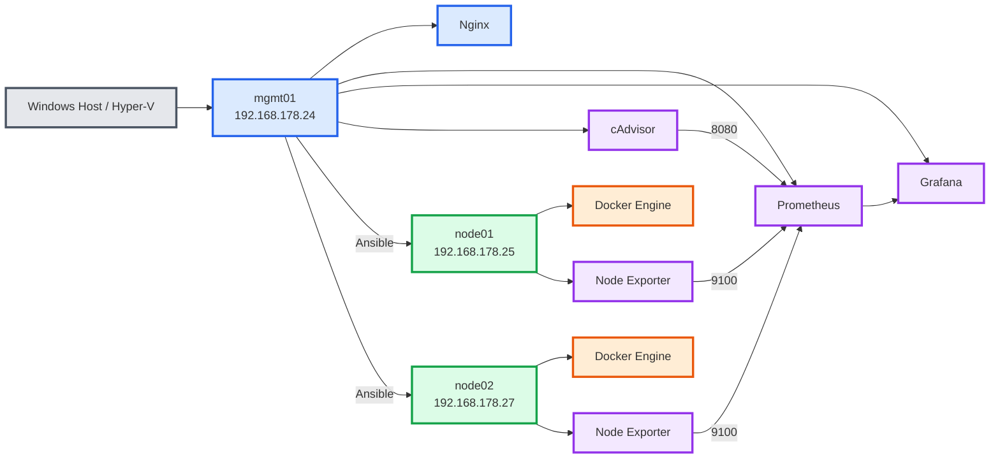

# Homelab Infrastructure

A personal DevOps and Security Operations (SOC) lab built on Hyper-V using Ubuntu virtual machines, Ansible automation, Docker containerization, and centralized service management.

---

## Project Goals

This homelab is designed to provide hands-on experience with:

- Linux system administration
- Infrastructure as Code (IaC)
- Configuration management
- Containerization
- Networking
- Reverse proxies
- Monitoring and observability
- Security Operations (SOC)
- CI/CD pipelines

---

## Current Technologies

### Virtualization

- Hyper-V

### Operating Systems

- Ubuntu Server

### Automation

- Ansible

### Version Control

- Git
- GitHub

### Containers

- Docker Engine
- Docker Compose

### Networking

- Nginx Reverse Proxy

### Monitoring

- Prometheus
- Grafana
- cAdvisor
- Node Exporter

### Security

- SSH Key Authentication

---

## Completed Milestones

### Infrastructure

- Hyper-V environment deployed
- Ubuntu management node deployed
- Ubuntu worker nodes deployed




### Access Management

- SSH key-based authentication configured
- SSH agent persistence configured
- Passwordless Ansible connectivity established

### Configuration Management

- Ansible inventory created
- Multi-node management verified
- Reusable Ansible role structure implemented

### Container Platform

- Docker installed through Ansible
- Docker service management automated
- Docker group permissions configured

### Networking

- Nginx reverse proxy deployed
- Centralized service access configured
- Firewall rules configured and validated

### Monitoring

- Node Exporter deployed on node01
- Node Exporter deployed on node02
- Prometheus deployed and configured
- Grafana deployed and configured
- cAdvisor deployed and configured
- Infrastructure dashboards imported
- Container monitoring dashboards imported
- Monitoring targets validated and healthy

---

## Repository Structure

```text
homelab/
├── ansible/
│   ├── inventories/
│   ├── roles/
│   └── playbooks/
│
├── monitoring/
│   ├── prometheus/
│   ├── grafana/
│   └── cadvisor/
│
├── docs/
│   ├── architecture.md
│   ├── buildlog.md
│   ├── ssh-agent-setup.md
│   ├── docker.md
│   └── reverse-proxy.md
│
└── README.md
```

---

## Documentation

| Document | Description |
|-----------|-------------|
| architecture.md | Infrastructure architecture and design |
| buildlog.md | Chronological implementation log |
| ssh-agent-setup.md | SSH key and agent configuration |
| docker.md | Docker deployment automation |
| reverse-proxy.md | Nginx reverse proxy configuration |

---

## Monitoring Stack

The monitoring stack is hosted on `mgmt01`.

### Components

- Prometheus
- Grafana
- cAdvisor
- Node Exporter

### Metrics Collected

- CPU utilization
- Memory utilization
- Disk usage
- Network traffic
- Docker container metrics
- Container resource consumption

### Access

- Grafana: http://<mgmt01-ip>:3000
- Prometheus: http://<mgmt02-ip>:9090

---

## Current Status

### Operational

- SSH management node
- Ansible automation
- Docker container hosts
- Nginx reverse proxy
- Prometheus monitoring
- Grafana dashboards
- cAdvisor container monitoring
- Node Exporter host monitoring

### In Progress


- Service deployment standardization

### Planned

- Wazuh
- Centralized logging
- CI/CD pipelines
- Kubernetes cluster
- Azure integration

---


